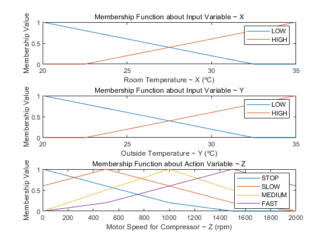
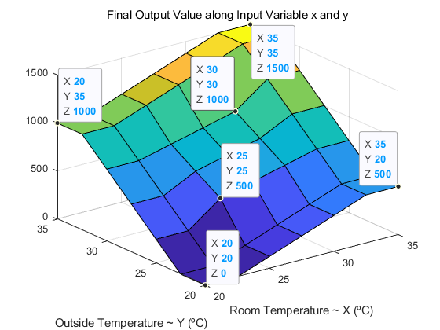
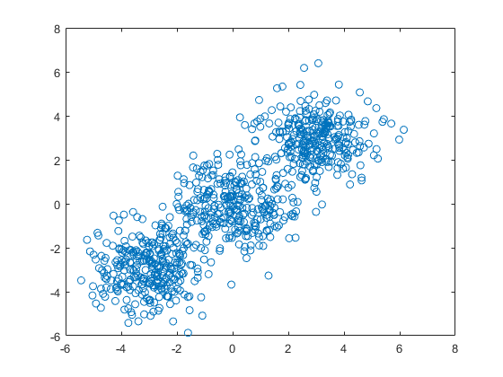
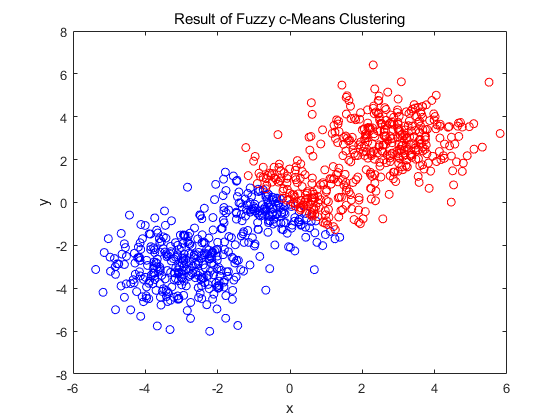
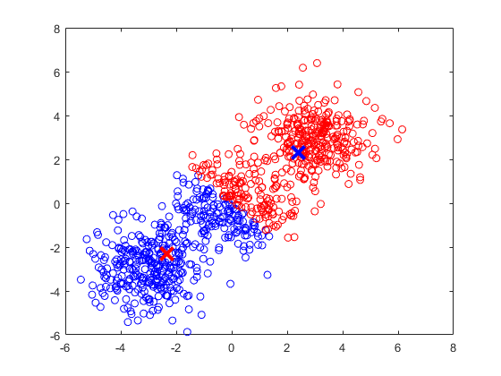
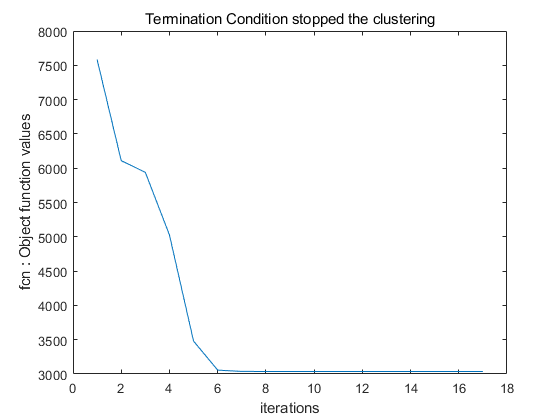

# Fuzzy Theory
Fuzzy Systems that deal with Linguistic Ambiguities and Uncertainty in the Real-world using Python


## Fuzzy System Example

```
<Settings>
output variable tip = { cheap = 10, average = 15}
intput variable x1, x2 = (5, 8)

<Activated Fuzzy Rules>
Rule No.1 : If service = good AND food = rancid,    then tip = cheap
Rule No.2 : If service = good AND food = delicous,  then tip = average

fuzzy subset F1(x), F2(y) is normalized

<Solution with Sugeno Fuzzy System>

w1 = AND(F1(x1), F2(x2)) = 0.2, z1 = 10 based on Rule No.1
w2 = AND(F1(x1), F2(x2)) = 0.8, z2 = 15 based on Rule No.2

Then, final output union z_n = (w1 * z1 + w2 * z2)/(w1 * w2) = (0.2 * 10 + 0.8 + 15)/(0.2 + 0.8) = 14
```

## Fuzzy Control

```
<Settings>
Using Max-Min Operation & Sugeno’s Simplified FIE

Input Variable Room Temperature ~ x
Input Variable Outside Temperature ~ y

Representative Values for x & y = [20  22.5  25  27.5  30  32.5  35] (ºC)

<Fuzzy Rules>
Rule No.1 : IF x in LOW   AND y is HIGH,  THEN z is SLOW    ~ 500 rpm
Rule No.2 : IF x in HIGH  AND y is LOW,   THEN z is MEDIUM  ~ 1000 rpm
Rule No.3 : IF x in HIGH  AND y is HIGH,  THEN z is FAST    ~ 1500 rpm
Rule No.4 : IF x in LOW   AND y is LOW,   THEN z is STOP    ~ 0 rpm
```

<p align="center">
  
  
</p>

## Fuzzy c-Means Clustering

Fuzzy c-Means Clustering is soft clustering in which the observation value for each cluster has a probability or probability(0~1) that is not a truth value(0 or 1).
This is different from k-Means Clustering.

```matlab
%2D Data is initialized from Random Functions following  code :

data_n = 300;
dist = 3; % for random wide distribution

data = randn(data_n, 2);
data = [data; randn(data_n,2)+dist*ones(data_n,2)];
data = [data; randn(data_n,2)-dist*ones(data_n,2)];

%optimization stopped until objective function improved by less than 0.001 between the final two iterations
Iteration count = 1, obj. fcn = 7583.608816
Iteration count = 2, obj. fcn = 6109.651661
Iteration count = 3, obj. fcn = 5939.244259
...
Iteration count = 15, obj. fcn = 3037.072359
Iteration count = 16, obj. fcn = 3037.072340
Iteration count = 17, obj. fcn = 3037.072333
```
<p align="center">
  
  
</p>

<p align="center">
  
  
</p>

